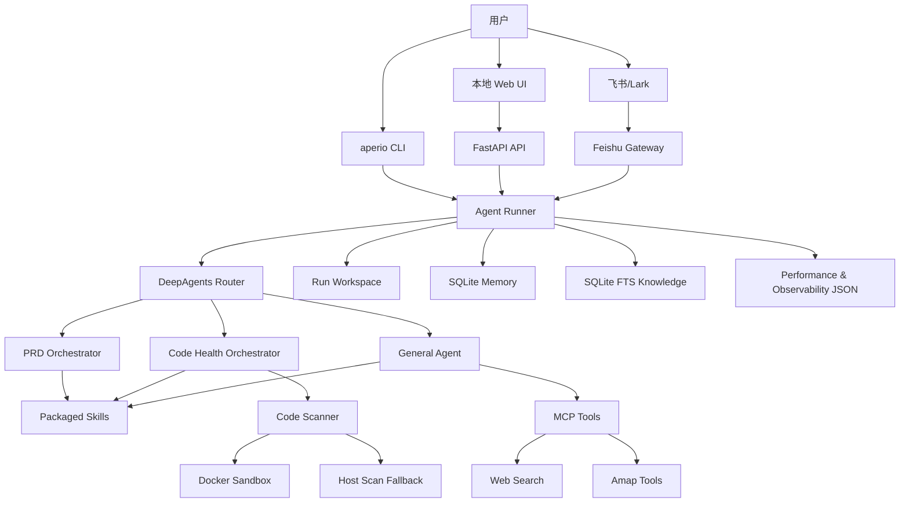

<h1 align="center">Aperio Agent</h1>

<p align="center">
  Local-first AI agent workspace with CLI, Web UI, DeepAgents orchestration, packaged skills, MCP tools, persistent memory, and Feishu/Lark integration.
</p>

<p align="center">
  <a href="https://www.python.org/"></a>
  <a href="https://fastapi.tiangolo.com/"></a>
  <a href="https://react.dev/"></a>
  <a href="https://vite.dev/"></a>
  <a href="https://github.com/langchain-ai/deepagents"></a>
  <a href="LICENSE"></a>
</p>

## 项目简介

Aperio Agent 是一个面向本地开发者和课程实践场景的智能体工作台。项目以 Python 包形式提供可安装的 `aperio` 命令，同时内置本地 Web UI、DeepAgents 多智能体编排、技能包、代码健康扫描、PRD 生成与评审、长期记忆、MCP 工具和飞书/Lark 软件渠道。

项目默认采用 local-first 架构：运行输入、输出产物、观测数据和本地知识库均写入用户本机，适合单用户研发辅助、项目文档生成、代码审查、需求分析和演示部署。可选能力包括 Docker 沙箱扫描、OpenAI-compatible 模型网关、公共 Web Search MCP、高德地图 MCP 和飞书机器人网关。

## 核心能力

- **命令行智能体**：运行 `aperio` 进入交互式终端会话，支持 slash 命令、技能补全、历史运行和产物查看。
- **一次性任务执行**：通过 `aperio run "..."` 执行单轮任务，适合脚本化调用和快速验证。
- **本地 Web UI**：通过 `aperio serve` 启动 FastAPI 服务，提供聊天、文件上传、运行记录、产物预览、记忆管理和可观测性页面。
- **DeepAgents 编排**：内置路由器和子智能体，按任务类型委托给 PRD、代码健康或通用智能体。
- **PRD 工作流**：支持 PRD 初稿生成、多角色评审、评审矩阵整合和最终文档产出。
- **代码健康扫描**：结合确定性扫描工具和代码健康技能包，输出架构、安全、依赖、文档和综合报告。
- **本地知识与记忆**：基于 SQLite FTS 索引 README、docs 和项目笔记，并记录可复用运行记忆。
- **MCP 工具扩展**：可启用公共 Web Search MCP；配置 `AMAP_API_KEY` 后可启用高德地图 MCP。
- **安全执行约束**：内置保守的只读安全命令包装器，限制 shell 元字符、工作目录和命令集合。
- **飞书/Lark 集成**：可作为机器人网关接收消息、下载多媒体附件，并用 CardKit 展示执行进度。

## 技术栈

| 层级 | 技术 |
| --- | --- |
| 后端语言 | Python 3.11+ |
| Agent 编排 | DeepAgents、LangChain、LangChain OpenAI |
| Web 服务 | FastAPI、Uvicorn、python-multipart |
| CLI | argparse、prompt-toolkit |
| 前端 | React 19、Vite、React Markdown、KaTeX、Lucide |
| 工具协议 | MCP、FastMCP、langchain-mcp-adapters |
| 本地存储 | SQLite、SQLite FTS、JSON/Markdown 运行产物 |
| 沙箱扫描 | Docker、内置 `code-health-toolkit` |
| 渠道集成 | Feishu/Lark Open Platform SDK |
| 质量验证 | Vite build、Playwright、Python 编译检查 |

## 系统架构



## 目录结构

```text
.
├── aperio_agent_backend/        # Python 后端包、CLI、Agent runner、DeepAgents 编排
│   ├── skill-assets/            # 内置 PRD、代码健康和公共工具 skills
│   ├── sandbox-assets/          # Docker 扫描沙箱 Dockerfile
│   ├── cli.py                   # aperio 命令入口
│   ├── runner.py                # 任务路由、输入输出产物、运行生命周期
│   ├── deepagents_engine.py     # DeepAgents router 与子智能体
│   ├── scanner.py               # 代码健康确定性扫描入口
│   ├── mcp_tools.py             # 可选 MCP 工具加载
│   └── feishu_gateway.py        # 飞书/Lark 网关
├── aperio_agent_web/            # FastAPI Web 应用与静态资源
│   ├── app.py                   # Web API 与页面路由
│   ├── frontend/                # React/Vite 源码
│   └── static/                  # 已构建静态页面和资源
├── demo/                        # 课程演示脚本、MCP 测试与 skills 示例
├── docs/                        # 项目文档与优化记录
├── scripts/                     # 前端资源同步、agent-browser 本地脚本
├── pyproject.toml               # Python 包与依赖定义
├── package.json                 # 前端依赖与 npm scripts
└── README.md
```

## 快速开始

### 1. 准备环境

推荐使用 Python 3.11+。如使用 Conda，可直接基于仓库中的环境文件创建环境：

```powershell
conda env create -f environment.yml
conda activate llm-dev
```

也可以使用现有 Python 环境安装本项目：

```powershell
pip install -e .
```

如需 MCP、Docker 沙箱或飞书集成，可按需安装 extras：

```powershell
pip install -e ".[mcp,sandbox,integrations]"
```

### 2. 初始化配置

```powershell
aperio init
```

> [!NOTE]
> `aperio init` 默认写入用户目录下的 `~/.aperio/`，不会把密钥写入项目仓库。

该命令会创建：

- `~/.aperio/.env`：本地密钥和环境变量。
- `~/.aperio/config.json`：模型供应商、默认模型和软件渠道配置。

常用环境变量如下：

```env
DEEPSEEK_API_KEY=
OPENAI_API_KEY=
OPENROUTER_API_KEY=
DASHSCOPE_API_KEY=
MOONSHOT_API_KEY=
SILICONFLOW_API_KEY=
APERIO_ENGINE=deepagents
APERIO_PROVIDER=
APERIO_MODEL=
APERIO_FALLBACK_MODEL=
APERIO_BASE_URL=
APERIO_MODEL_CALL_LIMIT=100
APERIO_TOOL_CALL_LIMIT=160
APERIO_SCAN_SANDBOX=auto
APERIO_ENABLE_MCP=0
APERIO_MEMORY_ENABLED=1
APERIO_KNOWLEDGE_ENABLED=1
APERIO_SAFE_EXECUTION_ENABLED=1
APERIO_EXTENSIONS_ENABLED=1
AMAP_API_KEY=
FEISHU_APP_ID=
FEISHU_APP_SECRET=
FEISHU_ENCRYPT_KEY=
FEISHU_VERIFICATION_TOKEN=
```

### 3. 检查配置

```powershell
aperio doctor
```

### 4. 启动 CLI

```powershell
aperio
```

执行单轮任务：

```powershell
aperio run "为这个项目生成一份代码健康报告"
```

### 5. 启动 Web UI

```powershell
aperio serve --host 127.0.0.1 --port 8088
```

浏览器打开：

```text
http://127.0.0.1:8088
```

源码开发模式也可以直接运行：

```powershell
python -m uvicorn aperio_agent_web.app:app --reload --host 127.0.0.1 --port 8088
```

## CLI 命令

| 命令 | 说明 |
| --- | --- |
| `aperio` | 启动交互式 CLI |
| `aperio init` | 创建或更新本地配置文件 |
| `aperio doctor` | 检查模型、环境变量、MCP、记忆和知识库状态 |
| `aperio run "..."` | 执行一次性任务 |
| `aperio serve --host 127.0.0.1 --port 8088` | 启动本地 Web UI |
| `aperio gateway feishu` | 启动飞书/Lark 网关 |

交互式 CLI 常用 slash 命令：

| 命令 | 说明 |
| --- | --- |
| `/help` | 查看帮助 |
| `/skills` | 列出内置和扩展 skills |
| `/doctor` | 检查当前环境和配置 |
| `/runs` | 查看最近运行 |
| `/artifacts` | 查看最近一次运行产物 |
| `/channels` | 查看软件渠道配置 |
| `/commands` | 查看项目/用户扩展命令 |
| `/knowledge` | 同步或搜索本地项目知识 |
| `/memory` | 查看、添加、删除持久记忆 |
| `/safe` | 执行受限只读安全命令 |
| `/serve` 或 `/web` | 从 CLI 启动 Web UI |
| `/exit` | 退出 |

## Web API

Web 服务由 `aperio_agent_web.app:app` 提供，主要接口如下：

| 方法 | 路径 | 说明 |
| --- | --- | --- |
| `GET` | `/` | Web UI 首页 |
| `GET` | `/observability` | 可观测性页面 |
| `GET` | `/memory` | 记忆管理页面 |
| `GET` | `/api/health` | 健康检查与基础配置状态 |
| `GET` | `/api/extensions` | 本地扩展信息 |
| `POST` | `/api/chat` | 普通聊天任务 |
| `POST` | `/api/chat/stream` | 流式聊天任务 |
| `GET` | `/api/runs` | 运行历史 |
| `GET` | `/api/runs/{run_id}` | 运行详情 |
| `POST` | `/api/runs/{run_id}/cancel` | 取消运行 |
| `DELETE` | `/api/runs/{run_id}` | 删除运行记录 |
| `GET` | `/api/runs/{run_id}/artifact` | 读取运行产物 |
| `GET/POST/PATCH/DELETE` | `/api/memories` | 持久记忆管理 |
| `GET` | `/api/observability/summary` | 观测指标汇总 |

## 运行产物

每次任务会生成独立运行目录：

```text
aperio_agent_backend/workspace/<run_id>/
├── inputs/                     # 用户输入、上传文件摘要、项目上下文
├── outputs/                    # Agent 生成的 Markdown/JSON/TXT 产物
├── observability.json          # 模型调用、工具调用、耗时和事件数据
├── performance.json            # 路由、耗时、成功状态和产物校验结果
└── answer.md                   # 最终回答
```

PRD 任务通常会输出 `outputs/prd_review/` 下的 PRD 初稿、评审草稿、评审矩阵和最终文档。代码健康任务通常会输出 `outputs/code_health/` 下的扫描原始数据、各维度草稿和最终报告。

## 配置说明

### 模型供应商

`~/.aperio/config.json` 使用 provider/channel 分层配置。默认结构如下：

```json
{
  "agents": {
    "defaults": {
      "model": "deepseek-v4-flash",
      "provider": "deepseek",
      "fallbackModel": ""
    }
  },
  "providers": {
    "deepseek": {
      "apiKey": "${DEEPSEEK_API_KEY}",
      "apiBase": "https://api.deepseek.com"
    },
    "openrouter": {
      "apiKey": "${OPENROUTER_API_KEY}",
      "apiBase": "https://openrouter.ai/api/v1"
    },
    "dashscope": {
      "apiKey": "${DASHSCOPE_API_KEY}",
      "apiBase": "https://dashscope.aliyuncs.com/compatible-mode/v1"
    },
    "custom": {
      "apiKey": "",
      "apiBase": ""
    }
  }
}
```

可用 provider 包括 `auto`、`deepseek`、`openai`、`openrouter`、`dashscope`、`moonshot`、`siliconflow` 和 `custom`。其中 `custom` 适合 vLLM、Ollama、LM Studio 或其他 OpenAI-compatible 网关。

### DeepAgents 运行限制

| 环境变量 | 默认值 | 说明 |
| --- | --- | --- |
| `APERIO_ENGINE` | `deepagents` | Agent 引擎，设为 `lite` 可启用轻量 fallback |
| `APERIO_MODEL_CALL_LIMIT` | `100` | 单次运行模型调用上限 |
| `APERIO_TOOL_CALL_LIMIT` | `160` | 单次运行工具调用上限 |
| `APERIO_MODEL_MAX_RETRIES` | `3` | 模型调用重试次数 |
| `APERIO_TOOL_MAX_RETRIES` | `2` | 工具调用重试次数 |
| `APERIO_FALLBACK_MODEL` | 空 | 可选 fallback 模型 |

### 扫描沙箱

| 变量 | 说明 |
| --- | --- |
| `APERIO_SCAN_SANDBOX=auto` | 优先使用 Docker 沙箱，失败后回退 host 扫描 |
| `APERIO_SCAN_SANDBOX=docker` | 强制使用 Docker 沙箱 |
| `APERIO_SCAN_SANDBOX=host` | 仅在宿主环境扫描 |
| `APERIO_INSTALL_PROJECT_DEPS=0` | 默认不安装被扫描项目依赖 |

Docker 模式会使用包内 `aperio_agent_backend/sandbox-assets/Dockerfile` 构建扫描镜像，并以只读方式挂载目标项目。

### MCP 工具

```powershell
pip install -e ".[mcp]"
```

```env
APERIO_ENABLE_MCP=1
AMAP_API_KEY=your-amap-key
```

> [!TIP]
> 只有任务需要公共搜索、地图查询或实时外部信息时才建议开启 MCP；普通代码审查和本地文档生成可以保持 `APERIO_ENABLE_MCP=0`。

启用后，通用智能体可使用公共 Web Search MCP；配置 `AMAP_API_KEY` 后可额外调用高德地图相关 MCP 工具。

### 飞书/Lark 网关

```powershell
pip install -e ".[integrations]"
aperio gateway feishu
```

> [!WARNING]
> 飞书/Lark 网关接入真实群聊前，应配置 `allowFrom` 和 `groupPolicy=mention`，避免机器人响应未授权用户或群内所有消息。

需要在 `~/.aperio/config.json` 中启用 `channels.feishu`，并配置 App ID、App Secret、Encrypt Key、Verification Token、`allowFrom`、`groupPolicy`、`streaming` 和 `maxMediaBytes`。

飞书应用侧需要启用机器人能力和消息事件订阅，例如 `im.message.receive_v1`。如使用 CardKit 展示流式进度，需要授予卡片写权限。

## 前端开发

安装 Node 依赖：

```powershell
npm install
```

启动 Vite 开发服务：

```powershell
npm run dev:frontend
```

构建前端资源：

```powershell
npm run build:frontend
```

同步 Lucide 静态资源：

```powershell
npm run sync:lucide
```

## 测试与验证

Python 基础编译检查：

```powershell
python -m compileall aperio_agent_backend aperio_agent_web
```

前端构建检查：

```powershell
npm run check:frontend
```

Playwright 端到端测试：

```powershell
npm run playwright:install
npm run test:e2e
```

MCP 高德工具 smoke test：

```powershell
python demo/test_amap_mcp_tools.py
```

## 安全说明

> [!WARNING]
> 本项目默认面向单用户本地使用，不建议在未增加认证、权限控制、审计和网络隔离前直接暴露到公网。

- 本项目定位为单用户本地工作台，默认不提供多租户认证、权限隔离或公网生产部署安全边界。
- `.env`、`~/.aperio/.env` 和 `~/.aperio/config.json` 中可能包含密钥，请勿提交到公开仓库。
- `APERIO_SAFE_EXECUTION_ENABLED=1` 默认启用保守安全执行策略，仅允许少量只读命令。
- Docker 扫描沙箱用于代码健康分析，不等同于完整的通用代码执行隔离环境。
- 开启 MCP 后，智能体可能访问外部搜索或地图服务；涉及实时信息时应保留来源和时间上下文。
- 飞书/Lark 网关建议使用 `allowFrom` 限制调用者，群聊场景建议保持 `groupPolicy=mention`。

## 常见问题

### 端口 8088 被占用

换用其他端口：

```powershell
aperio serve --host 127.0.0.1 --port 8089
```

或查看占用进程：

```powershell
Get-Process -Id (Get-NetTCPConnection -LocalPort 8088).OwningProcess
```

### Docker 扫描不可用

> [!TIP]
> 如果只是本地课程演示或文档生成，可以先切换到 `host` 扫描；需要更稳定隔离时再启动 Docker Desktop。

确认 Docker Desktop 已启动，或切换到 host 扫描：

```env
APERIO_SCAN_SANDBOX=host
```

### MCP 工具不可用

确认安装了 MCP extras，并启用了环境变量：

```powershell
pip install -e ".[mcp]"
```

```env
APERIO_ENABLE_MCP=1
```

### Web UI 无法调用模型

> [!NOTE]
> Web UI 和 CLI 共用同一套后端配置。CLI 中 `aperio doctor` 通过后，Web UI 通常也会使用相同 provider 和模型配置。

运行：

```powershell
aperio doctor
```

重点检查 API Key、`APERIO_PROVIDER`、`APERIO_MODEL`、`APERIO_BASE_URL` 和 `~/.aperio/config.json` 的 provider 配置。

## 许可证

本项目基于 [MIT License](LICENSE) 开源。
